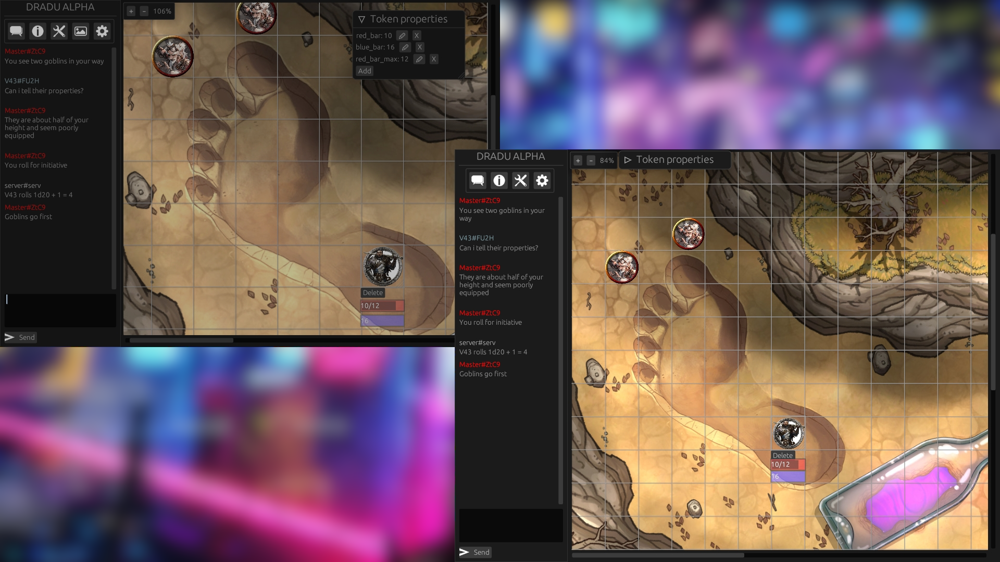

# Dradu

The goal of this project is to make a FOSS virtual tabletop tool which is able
to run both natively and in browser - make a better alternative for those
proprietary and laggy VTTs

## Current state

This project is *kinda* usable if you are tech savvy (Ready to dig through
the source code) and aren't afraid of occasional bugs or inconveniences.
For everyone else this project is still too raw for actual use

Some mistakes were made during Dradu designing, so right now this project is
staged for a rewrite. The goals are: transition from `egui` to something else
(Presumably `iced`), rewrite server in Rust using async code, transition from
using TCP sockets to WebSockets and HTTP

## Running and using the program

### Setup
 1. CD into **server** directory and run `./main.py`
  (If it doesn't work - try using python3.9 or newer)
 2. Open another terminal, CD into **client** directory and run the client
  using `cargo run --release` (It may take a while to compile)
 3. In the client, enter servers IP address and press *"New game"*. Server
  should've outputted its IP to the terminal when you launched it
 4. To connect another client to the room you've just created, click on the *"Info"*
  tab and copy room address using the *"Copy"* button. Paste it into another
  client and hit *"Join"*

### Adding assets

Only GM can add assets to the scene. They are stored locally on your
computer in `~/.local/share/dradu/assets`. You can move them to this directory
or open *"Assets"* tab and simply drag-and-drop them into it - Dradu will
copy dropped assets into its local storage. To add asset to the scene, simply
click on its name in *"Assets"* tab. You can right-click it and set it
as background image

### Chat commands

They are implemented on the server side. Current server supports the following
commands:

 - `/nickname <NAME>` `/nick <NAME>` - Change your nickname
 - `/color <R> <G> <B>` - Change your nickname color. RGB values are from 0 to 255
 - `/roll <QUERY>` `/r <QUERY>` - Roll a dice. Exmple: `/r 2d20 + 3`

## Project roadmap for the near future
 - [X] Add tokens with attributes (Health, armor, etc.)
 - [X] Implement saving/loading entire maps
 - [ ] Add ability to move objects up/down a layer
 - [X] Dice rolling
 - [X] Built-in loopback server used for creating maps
 - [ ] Implement permissions for certain actions
